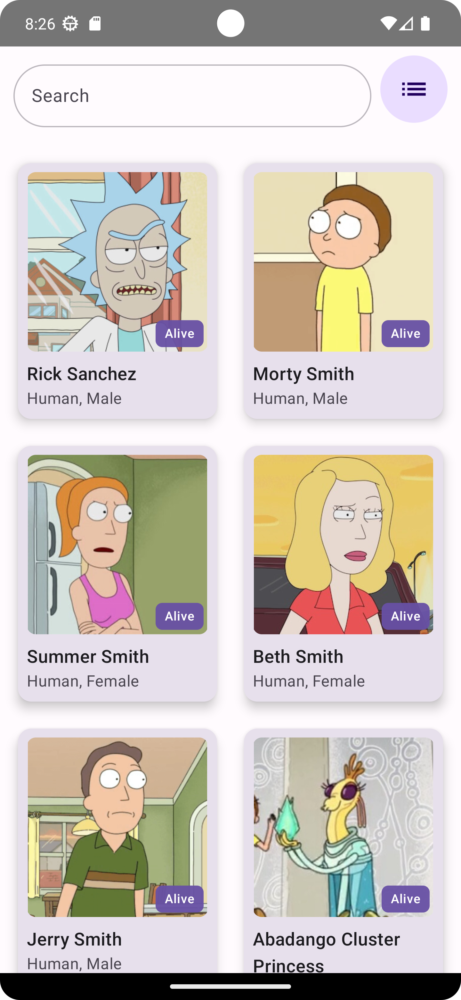
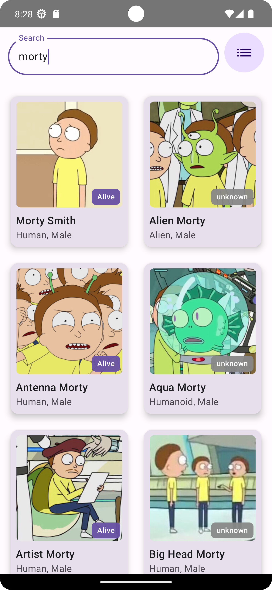
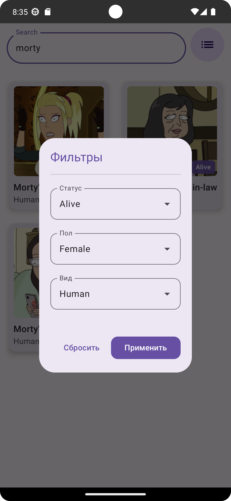
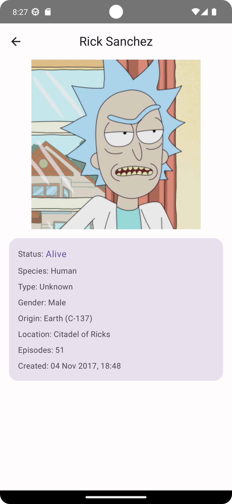

# Rick and Morty App

Приложение, созданное на **Jetpack Compose** с использованием **чистой архитектуры (Clean Architecture)** и **паттерна MVVM**, для работы с API вселенной **Rick and Morty**.  
Реализована работа с сетью и локальным кешем (**Offline First**), фильтрация, поиск и пагинация персонажей.

---

## Основные возможности

- **Главный экран** — список персонажей с карточками  
- **Поиск по имени** — возможность быстро находить персонажей  
- **Фильтрация** — фильтры по статусу, виду и полу  
- **Детальная страница** — отображение подробной информации о выбранном персонаже  
- **Offline First** — данные кэшируются и доступны без интернета  
- **Пагинация** — реализована через `Paging 3` с `RemoteMediator`  
- **Чистая архитектура + MVVM**  
- **Dependency Injection** — используется `Koin`  
- **Современный UI** на `Jetpack Compose`  
- **Kotlin Coroutines & Flow** для реактивных обновлений  

---

## Архитектура проекта

Проект построен по **Clean Architecture + MVVM** и разделён на независимые модули:

```text
project-root/
│
├── core/                 # Общие классы и утилиты (модели, network utils)
├── data/                 # Источники данных: API, DAO, Room, репозитории
├── domain/               # UseCase и интерфейсы репозиториев
├── feature_characters/   # Экран списка и экран деталей персонажей
└── app/                  # Главный модуль с навигацией и точкой входа
```

---

## Используемые технологии и библиотеки

| Категория | Библиотека |
|------------|------------|
| UI | **Jetpack Compose**, **Material3**, **Coil** |
| Архитектура | **MVVM**, **Clean Architecture**, **Koin DI** |
| Асинхронность | **Kotlin Coroutines**, **Flow** |
| Пагинация | **Paging 3**, **RemoteMediator** |
| Сеть | **Retrofit 2**, **OkHttp** |
| База данных | **Room (DAO, Entity)** |
| Offline First | Кэширование данных при отсутствии интернета |
| Навигация | **Jetpack Navigation Compose** |

---

## Логика работы

- При первом запуске данные загружаются из **API (Rick and Morty API)**  
- После загрузки они **сохраняются в базу Room**  
- При следующем запуске или отсутствии сети данные **берутся из кеша**  
- При наличии интернета происходит **автоматическое обновление данных**

---

## Скриншоты приложения

| Главный экран                    | Поиск                          |
|-------------------------------------|-----------------------------------|
|  |  |

| Фильтры                          | Детали персонажа                       |
|-------------------------------------|-------------------------------------------|
|  |  |

